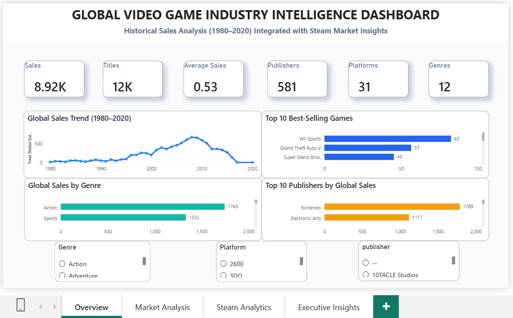
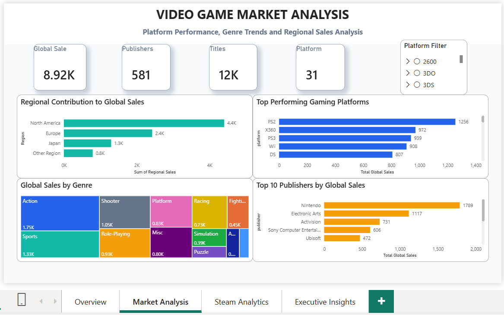
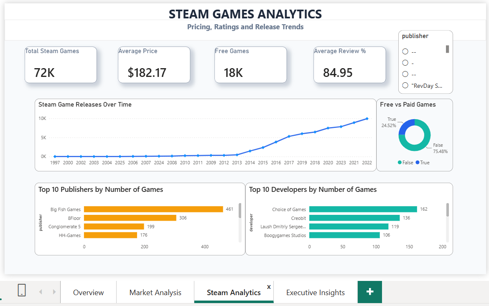
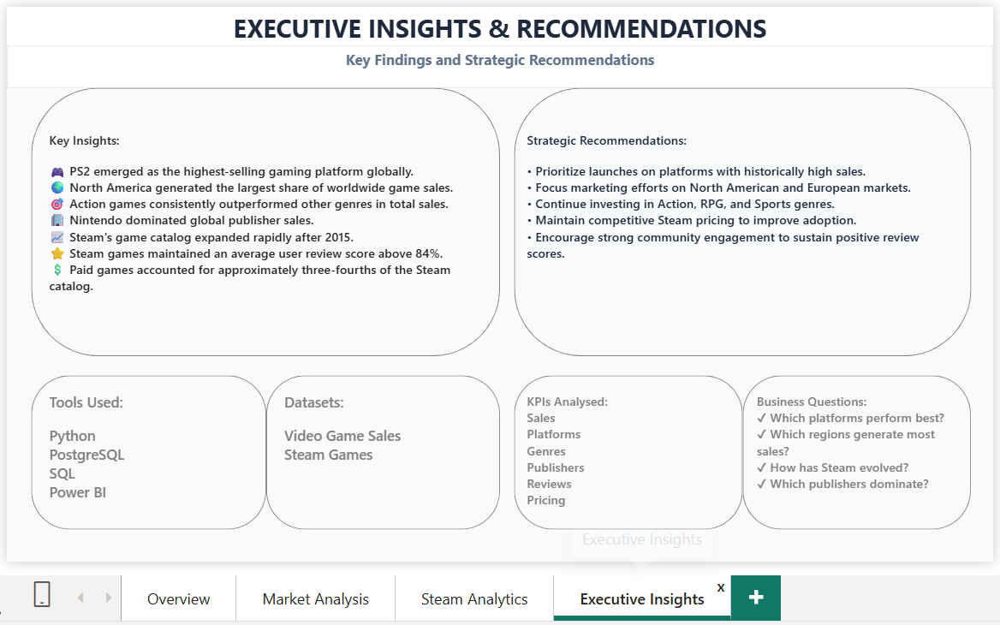

# 🎮 Global Video Game Industry Intelligence


An end-to-end Data Analytics project that explores historical video game sales and Steam marketplace trends to uncover actionable business insights using **Python, PostgreSQL, SQL, and Power BI**.

---

## 📌 Project Overview

The video game industry is one of the largest entertainment markets in the world, generating billions in annual revenue across multiple platforms and regions. This project combines historical video game sales data with Steam marketplace data to analyze sales performance, genre popularity, regional demand, pricing strategies, and customer reviews.

The project demonstrates a complete analytics workflow, from data cleaning and preprocessing to interactive dashboard development and business recommendations.

## 🎯 Business Objectives

This project aims to answer key business questions such as:

- Which gaming platforms generated the highest global sales?
- Which publishers and genres dominated the market?
- How do sales differ across geographical regions?
- How has the Steam marketplace evolved over time?
- What pricing and review patterns exist among Steam games?
- What strategic insights can help gaming companies make better business decisions?

## 🛠️ Tech Stack

| Technology | Purpose |
|------------|---------|
| Python | Data Cleaning & Preprocessing |
| Pandas | Data Manipulation |
| PostgreSQL | Database Management |
| SQL | Data Querying & Analysis |
| Power BI | Dashboard Development |
| GitHub | Project Documentation & Version Control |


## 📂 Project Workflow

```text
Raw Datasets
     │
     ▼
Data Profiling (Python)
     │
     ▼
Data Cleaning & Preprocessing
     │
     ▼
PostgreSQL Database
     │
     ▼
SQL Queries & Data Analysis
     │
     ▼
Power BI Dashboard
     │
     ▼
Business Insights & Recommendations

```
## 📂 Datasets

This project combines two datasets:

### Video Game Sales Dataset
- Historical global video game sales
- Platform, genre, publisher, regional sales
- Critic and user review scores

### Steam Games Dataset
- Steam game catalog
- Pricing and discounts
- Review summaries
- Release information
- Developer and publisher details

## 🗄️ SQL Analysis

The SQL scripts include:

- Database schema creation
- SQL views for integrated analysis
- Business queries covering:
  - Top-selling games
  - Publisher performance
  - Genre trends
  - Regional sales
  - Platform comparison
  - Critic vs User ratings
  - Steam analytics
 
## 📊 Power BI Dashboard

The complete interactive Power BI report is included in the **Power-BI** folder.

Open the `.pbix` file using Microsoft Power BI Desktop to explore all dashboard pages and visuals.

## 📊 Dashboard Overview

The Power BI report consists of four interactive dashboard pages designed to answer different business questions.

### 📈 1. Executive Overview
- Overall sales performance
- Global KPIs
- Sales trends
- Top-performing games

### 🌍 2. Market Analysis
- Regional sales distribution
- Platform performance
- Genre analysis
- Publisher analysis

### 🎮 3. Steam Analytics
- Steam release trends
- Pricing analysis
- Free vs Paid games
- Publisher & Developer analysis
- Review analytics

### 💡 4. Executive Insights
- Key findings
- Business recommendations
- Strategic takeaways

## 📷 Dashboard Preview

### Executive Overview



---

### Market Analysis



---

### Steam Analytics



---

### Executive Insights



## 🔍 Key Insights

- 🎮 **PlayStation 2** emerged as one of the highest-selling gaming platforms in the historical dataset.
- 🌍 **North America** contributed the largest share of global video game sales.
- 🏆 **Action** and **Sports** genres consistently dominated global sales.
- 🏢 A small number of publishers accounted for a significant portion of the market.
- 📈 The number of games released on **Steam** increased rapidly over recent years.
- ⭐ Most Steam titles maintained strong user review scores, indicating positive player engagement.
- 💰 Paid games formed the majority of the Steam marketplace, while free-to-play titles represented a smaller but important segment.

## 💡 Business Recommendations

Based on the analysis, gaming companies can consider the following strategies:

- Focus future releases on historically successful gaming platforms.
- Prioritize North American and European markets for marketing campaigns.
- Continue investing in high-performing genres such as Action and Sports.
- Monitor Steam pricing strategies to remain competitive.
- Improve customer engagement and post-launch support to maintain positive user reviews.

## 📁 Repository Structure

```text
Global-Video-Game-Industry-Intelligence
│
├── Data
│   ├── video_games_sales_cleaned.csv
│   ├── steam_games_cleaned.csv
│   ├── Data_Dictionary - Video_games_sales_dataset.csv
│   └── Data_Dictionary - Sheet2.csv
│
├── Images
│   ├── overview.png
│   ├── market-analysis.png
│   ├── steam-analytics.png
│   └── executive-insights.png
│
├── Power-BI
│   └── Global_Video_Game_Industry_Intelligence.pbix
│
├── Python
│   ├── 01_Data_Profiling.ipynb
│   ├── 02_Data_Cleaning.ipynb
│   └── 03_Steam_Data_Cleaning.ipynb
│
├── SQL
│   ├── 01_Database_Schema.sql
│   ├── 02_SQL_Views.sql
│   └── 03_Business_Analysis.sql
│
└── README.md
```

## 🚀 Future Improvements

- Integrate live Steam API data for real-time analytics.
- Develop predictive models for video game sales forecasting.
- Perform sentiment analysis on Steam user reviews.
- Publish the dashboard through Power BI Service for online access.
- Automate the ETL pipeline for scheduled data refreshes.

## 👩‍💻 Author

**Aayushi**

Computer Science Undergraduate | Aspiring Data Analyst

**Skills:** Python • SQL • PostgreSQL • Power BI • Data Visualization • Business Intelligence

If you found this project interesting, feel free to explore the repository and connect with me.
